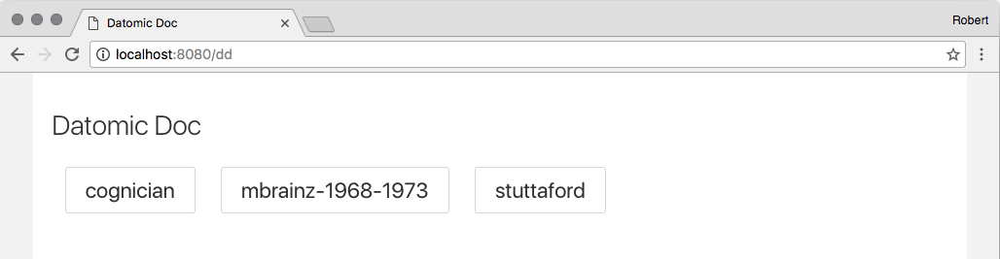
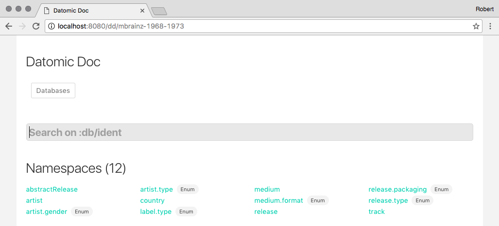
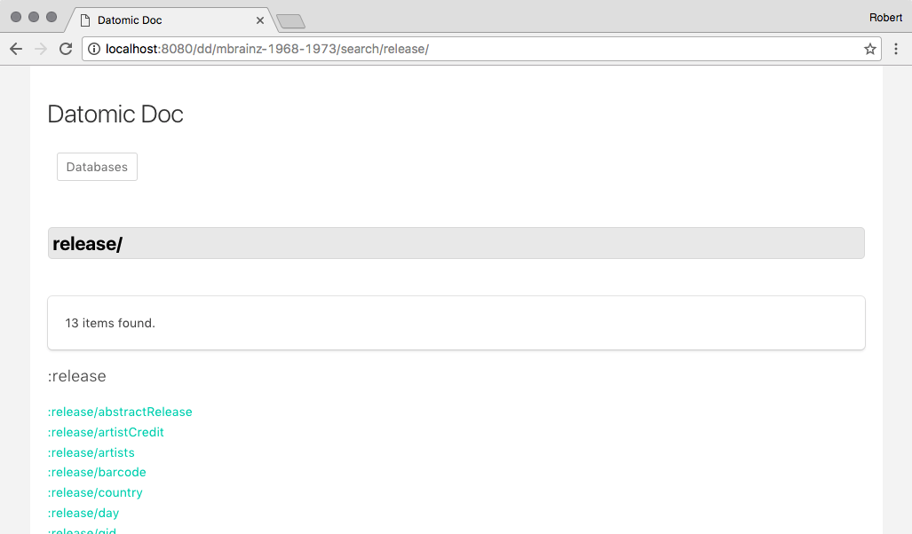
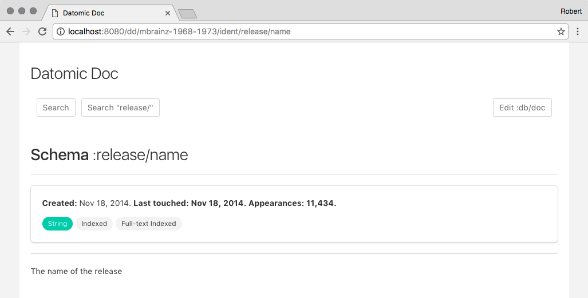
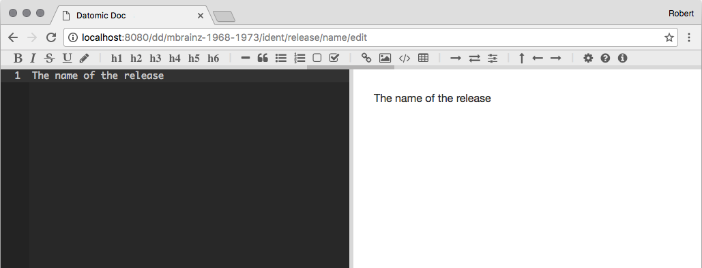

# Datomic Doc

Manage `:db/doc` string values for any addressable entity in a Datomic database.

- [Rationale](#rational)
- [Features](#features)
  - [Database list](#database-list)
  - [Search](#search)
  - [Permalinks](#permalinks)
  - [Metadata display](#metadata)
  - [Doc-string Editor](#doc-string-editor)
- [Installation](#installation)
- [Configuration](#configuration)
- [Contributing](#contributing)
- [Development](#development)
- [License](#license)

------

## Rationale

Why put documentation somewhere separate when it can live with the very things it's documenting; thereby benefiting from an identical information architecture and all the great facilities that Datomic offers?

This tool, designed as a plug-and-play Ring middleware, aims to bring this idea to life.

Typically used to manage doc-strings for schema and enumeration values, but can be used to document arbitrary entities — if those entities have a valid unique string attribute (so, a [lookup ref](http://blog.datomic.com/2014/02/datomic-lookup-refs.html)).

Possible applications:
- Document schema, database functions, enums, and database partitions.
- Document key entities in your database:
  - Products
  - Clients
  - Staff user accounts
  - Configuration data
  - Operational notes for a key client
  - Operational notes for an API integration
- Make entities specifically just to use in Datomic Doc:
  - Foundational topics about your system, in a `:doc.<section>/topic` scheme.
  - [`clojure.spec`](http://clojure.org/guides/spec) docs.

You have total control (via predicates that run per request) over who can see and/or do what (assuming you already have a login system).

The sky is the limit!

------

## Features

### Database list

At `/dd`, an alphabetised list of all provided databases, in the case that more than one is configured. Leads to [Search](#search).



### Search

At `/dd` (or `/dd/:database-name`), a search UI, which searches all `:db/ident` values - schema, enums, partitions and database functions (Datomic's own idents are excluded). Results lead to [Permalinks](#permalinks).

##### Namespace list

Any namespace fully populated by non-schema idents will display their type as a tag -- one of `partition`, `function`, or `enum`.



#### Search examples:

Query | Search result | Examples
---|---|---
`user` | Presence of query in namespace and name of ident. | `:user/email`, `:group/users`
`user/` | Exact match of query to namespace of ident. | `:user/email`, `:user/password`
`/user` | Presence of query in name of ident. | `:group/users`, `:license/max-user-count`

##### Searching for namespace



### Permalinks

#### Idents

`/dd/ident/:name` or `/dd/ident/:namespace/:name` (or `/dd/:database-name/ident/...`)

⟶ Entity by direct `:db/ident` lookup with: `:<[namespace/]name>`.

##### Examples

 `/dd/ident/unused` ⟶ `:unused`

 `/dd/ident/db/doc` ⟶ `:db/doc`

#### Entities

`/dd/entity/:name/:value` or `/dd/entity/:namespace/:name/:value` (or `/dd/:database-name/entity/...`)

⟶ Entity by lookup ref lookup with: `[:<[namespace/]name> <value>]`.

This requires that the attr be `:db/unique` and that the value be of `:db/valueType` `:db.valueType/string`.

##### Examples

 `/dd/entity/tag/value` ⟶ `[:tag "value"]`

 `/dd/entity/user/email/no@spam.thanks` ⟶ `[:user/email "no@spam.thanks"]`

**Note:** Question mark characters are represented as `__Q` in permalinks:
- e.g. `:user/opt-in?` ⟶ `/dd/ident/user/opt-in__Q`.

### Metadata



#### All entities

- Created timestamp.
- Last used timestamp.
- Usage count (by count of datoms).

#### Schema only

- Type.
- Cardinality.
- Uniqueness.
- Flags:
  - Indexed (only show if not also Unique).
  - No History.
  - Is Component.
  - Fulltext.

#### Schema and enum values only

- Deprecated — if deprecated, indicate this.
- A link to search for all other entities sharing this a namespace with this entity; i.e. a search for `<namespace>/`.

### Doc-string Editor



Append `/edit` to any [permalink](#permalinks), e.g. `/dd/ident/db/doc/edit`.

Loads the entity's `:db/doc` string into the <https://github.com/tylingsoft/markdown-plus> Markdown editor.

Active user needs to satisfy `::dd/allow-write-pred` predicate.

#### Notable 'Markdown Plus' features include:

Try it out for yourself with its online demo: <http://mdp.tylingsoft.com/>.

- Real-time HTML preview, with scroll lock
- Clojure syntax highlighting
- [Github-flavoured markdown](https://help.github.com/articles/github-flavored-markdown/)
- [Table of contents](http://mdp.tylingsoft.com/#table-of-contents)
- [Flowcharts](http://mdp.tylingsoft.com/#flowchart)
- [Sequence diagrams](http://mdp.tylingsoft.com/#sequence-diagram)
- [Charts](http://mdp.tylingsoft.com/#charts)

------

## Installation

Leiningen or boot coordinates:

```clojure
[cognician/datomic-doc "0.1.0"]
```

**Note**: Datomic Doc expects you to have a valid Datomic peer library in your project.

Integration with your web service handler, using a sensible "getting started" configuration:

```clojure
(require '[cognician.datomic-doc :as dd]
         '[cognician.datomic-doc.ring :as ddr])

(def handler
  (-> routes
      (ddr/wrap-datomic-doc
       {::dd/datomic-uri "datomic:free://localhost:4334/*"
        ::dd/allow-write-pred (constantly true)}))
```

------

## Configuration

See the spec and default options in  [cognician.datomic-doc.options](https://github.com/Cognician/datomic-doc/tree/master/src/cognician/datomic_doc/options.clj).

##### Important notes:

- One of `::dd/datomic-uri` or `::dd/datomic-uris` is required.
- If neither of the `::dd/allow-*-pred` options is provided, the UI will not be available to anyone.

#### Configuration options

Key | Type
---|---|---
`::dd/datomic-uri` | String

Valid Datomic database URI or wildcard URI. Wilcard URI uses `*` in place of the database name. If wildcard, will use `datomic.api/get-database-names` to discover all databases and populate `::dd/datomic-uris` **during HTTP request processing**.

Key | Type
---|---|---
`::dd/datomic-uris` | String

Set of valid Datomic database URIs. If provided (or if wildcard uri is provided), a database list will be provided to the end user to choose from.

Key | Type
---|---|---
`::dd/allow-write-pred` | Predicate function

Enables the full editing UI for the active user. A function which takes the request and must return `true` if the active user may edit doc-strings. Users who pass this check automatically pass the check for `::dd/allow-read-pred`.

Requests maps include whatever context is available for the route the user is attempting:

- `:options` for the configured options (with any wildcard database uri expanded to a full database list).
- `:routes` for the route table, which may include routing for multiple databases.
- `:db-uri` for the active database - either the only configured database, or the user-selected database when multiple databases are in use.
- `:entity` with the data necessary to render the detail and edit views.

For detail and edit views, to access the entity the user is viewing:

```clojure
(datomic.api/entity (d/db (d/connect (:db-uri request)))
                    (get-in request [:entity :lookup-ref]))
```

It should be possible to implement a fine-grained ACL with these two predicates and this context.

Key | Type
---|---|---
`::dd/allow-read-pred` | Predicate function

Enables read-only UI for the active user. A function which takes the request and must return `true` if the active user may access the UI, but not alter anything.

All the same context is available.

Key | Type
---|---|---
`::dd/annotate-tx-fn` | Function

Allows for Datomic Doc's transactions to be annotated. A function which takes the request and a map and must return that map with any attr/value pairs that should be transacted on the inbound transaction.

Key | Type
---|---|---
`::dd/deprecated-attr` | Keyword

When asserted with a truthy value on any entity with `:db/ident`, will cause the UI to display a "Deprecated" notice for that entity. Also, fully deprecated _namespaces_ (where all attributes in a namespace are deprecated) will be listed separately in the namespace list.

Key | Type
---|---|---
`::dd/count-datoms?` | Boolean

When true, the metadata stats will display a count of all datoms that an entity participates in. For databases with large datom counts, this may slow things down, and adversely affect peer caches. Use this to switch it off if you don't want a performance impact on production systems.

Key | Type
---|---|---
`::dd/uri-prefix` | String

The first segment of all routes served by Datomic Doc. Default value is `"dd"`.

### Example configuration

```clojure
{::dd/datomic-uri      "datomic:free://datomic-doc"
 ::dd/allow-write-pred (fn [request]
                         (contains? (get-in request [:user :roles]) :admin))
 ::dd/allow-read-pred  (fn [request]
                         (contains? (get-in request [:user :roles]) :staff))
 ::dd/annotate-tx-fn   (fn [request tx-map]
                         (assoc tx-map :transaction/altered-by
                                ;; must be a valid entity id or lookup ref.
                                [:user/email (get-in request [:user :email])]))
 ::dd/deprecated-attr  :datomic-doc/deprecated
 ::dd/uri-prefix       "datomic-doc"}
```

------

## Contributing

Pull requests are welcome!

Development notes are kept in [TODO.md](https://github.com/Cognician/datomic-doc/tree/master/TODO.md).

------

## Development

Visit `dev/user.clj` and modify `user/db-uri` and `user/config` to your preference.

Start the dev service `make`, issue `M-x cider-ns-refresh` to start the development web-server.

Then visit `http://localhost:8080/dd`.

#### Production mode

To test production artifacts, set `user/config`'s `::dd/dev-mode?` to `false`, and ensure you have the production JS building:

`lein cljsbuild auto main`

Then visit `http://localhost:8080/dd`.

#### Building

Use `lein package` to check that JVM code compiles, build production Javascript and build a .jar file.

------

## License

Copyright Cognician Software (Pty) Ltd.

Distributed under the Eclipse Public License, the same as Clojure.

[Markdown Plus](https://github.com/tylingsoft/markdown-plus) copyright [Tylingsoft](http://tylingsoft.com/), distributed under the MIT license.

[Bulma](http://bulma.io/) copyright [Jeremy Thomas](http://jgthms.com/), distributed under the MIT license.
